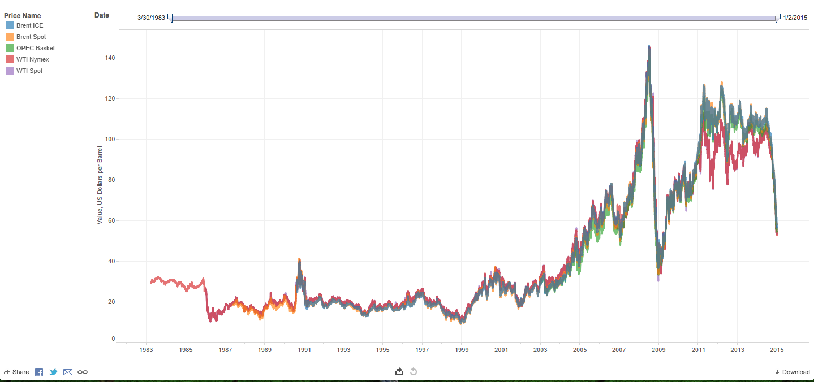

crude-crises-value
==================

inspired by [this tweet](https://twitter.com/VonnieQuinn/status/551060240582856705) 

@VonnieQuinn Citi's Morse: "The unintended consequences of lower oil prices will be a 
major geopolitical problem in 2015". Expect a LOT of volatility.

this repo seeks to answer the question "What is the value of a geopolitical crisis to the price of oil?"

here's a plot of [crude oil prices since '83](https://public.tableausoftware.com/profile/micah.stubbs#!/vizhome/crude-price-history/CrudeOilPriceHistory):

next step:  find a nice list of geopolitical problems with start and end dates

